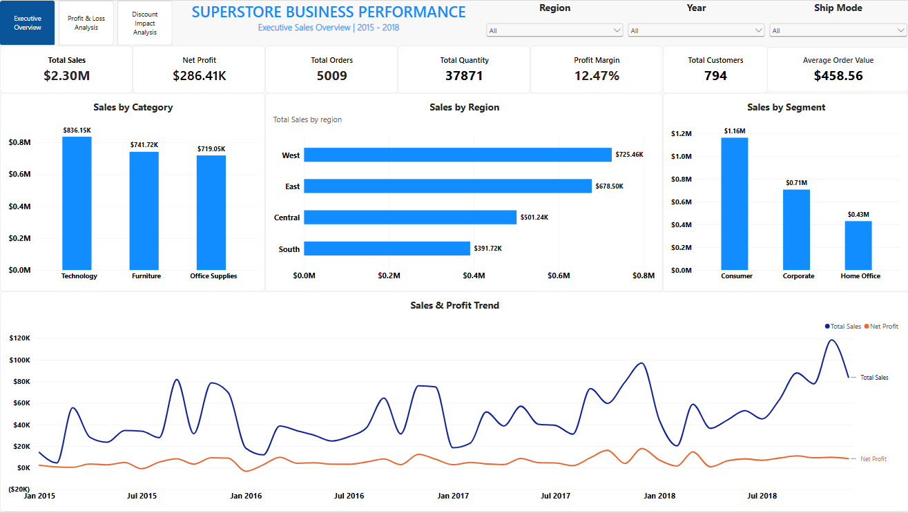
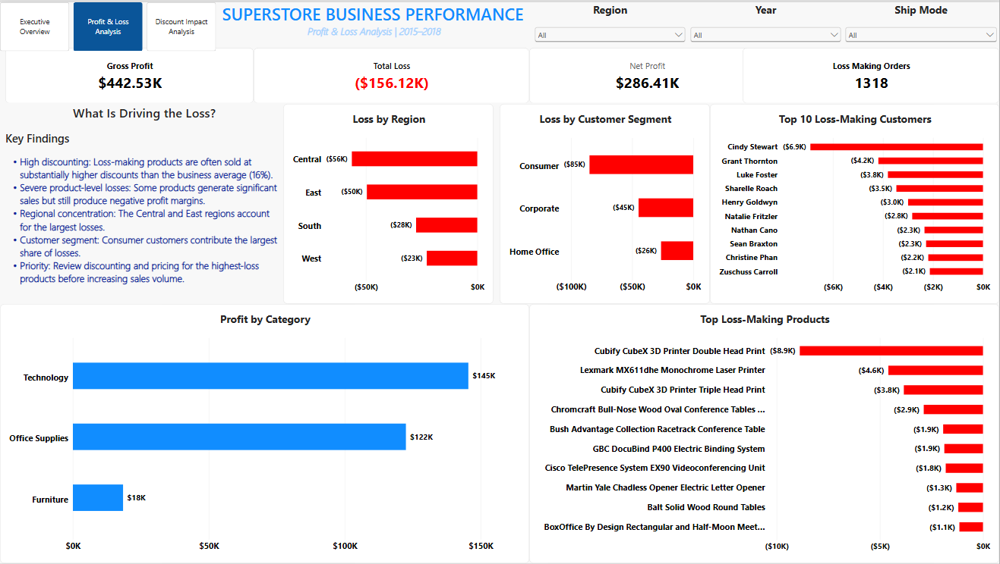
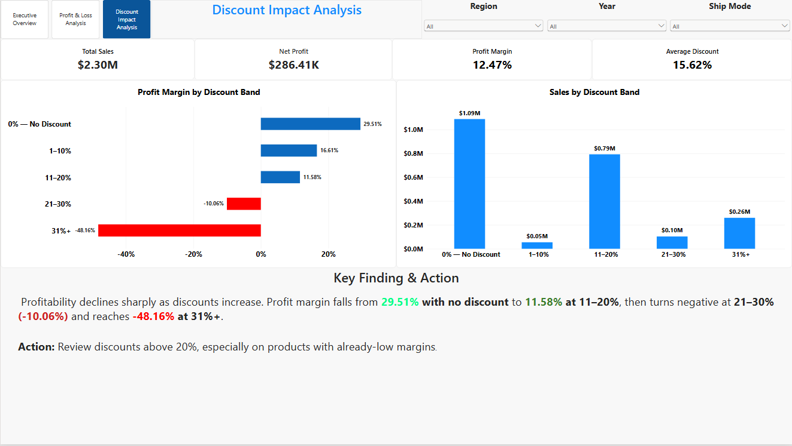

# Superstore Commercial Audit

## An End-to-End Sales, Profitability & Discount Analysis

This project is an end-to-end commercial analytics case study built using the **Sample Superstore dataset obtained from Kaggle**.

The objective is to move beyond basic sales reporting and investigate commercial performance from three perspectives:

1. **Overall business performance**
2. **Profit and loss drivers**
3. **The relationship between discounting and profitability**

The project combines **Python, Pandas, Google Sheets, and Power BI** to create a complete analytical workflow from data preparation through to business recommendations.

---

# Executive Summary

The Sample Superstore dataset records approximately **$2.30M in sales** and **$286.41K in net profit**.

Although the dataset is profitable overall, the analysis reveals significant underlying loss-making activity.

Key findings include:

- **$2.30M** in total sales
- **$286.41K** in net profit
- **$442.53K** in positive profit before offsetting losses
- **$156.12K** in total losses
- **5,009** distinct orders
- **1,318** loss-making orders
- approximately **12.47%** overall profit margin

The analysis also shows that profitability deteriorates as discount levels increase, highlighting discount management as an important commercial consideration.

The purpose of the project is therefore not simply to answer **"How much did we sell?"**, but to answer:

> **Where is the dataset generating profit, where is it generating losses, and what commercial decisions could improve profitability?**

---

# Business Problem

A sales report can show strong revenue while hiding significant profitability problems underneath.

For example:

- A product may generate high sales but negative profit.
- A customer may purchase frequently but remain unprofitable.
- A region may generate substantial revenue while producing weak margins.
- A discount may increase sales volume while reducing profitability.
- Strong overall profit may conceal a large number of loss-making transactions.

This project was therefore designed as a **commercial audit** rather than simply a sales dashboard.

The analysis investigates the relationship between:

**Sales → Discounts → Profit → Commercial Performance**

---

# Business Questions

The analysis is structured around three major business questions.

## 1. Executive Performance

**How is the business performing overall?**

The analysis investigates:

- What are total sales?
- What is net profit?
- What is the overall profit margin?
- How many orders are represented?
- How many customers are represented?
- What is the average order value?
- Which categories generate the most sales?
- Which regions generate the most sales?
- Which customer segments generate the most sales?
- How do sales and profit change over time?

---

## 2. Profit & Loss

**Where is the business making money and where is it losing money?**

The analysis investigates:

- How much profit is being generated?
- How much loss is being incurred?
- How many orders are loss-making?
- Which categories are profitable or unprofitable?
- Which sub-categories are contributing to losses?
- Which regions generate the greatest losses?
- Which customer segments generate the greatest losses?
- Which customers are loss-making?
- Which products are loss-making?
- Which individual orders are generating negative profit?

---

## 3. Discount Impact

**Is discounting helping the business grow profitably, or is it destroying margin?**

The analysis investigates:

- How does profit change as discount levels increase?
- Which discount bands generate the strongest margins?
- At what discount level does profitability begin to deteriorate?
- Are higher discounts associated with negative margins?
- Should discounting be applied more selectively?

---

# Dataset

The project uses the **Sample Superstore dataset obtained from Kaggle**.

The dataset contains transactional retail information covering areas such as:

- Orders
- Customers
- Products
- Categories
- Sub-categories
- Sales
- Quantity
- Discount
- Profit
- Regions
- Customer Segments
- Order Dates

These fields make the dataset suitable for investigating both **revenue performance** and **commercial profitability**.

The dataset was imported into **Google Sheets** and subsequently processed and analyzed using Python.

---

# Analytical Objectives

The project has four primary objectives:

### 1. Prepare reliable analytical data

Clean and validate the dataset using Python before performing the analysis.

### 2. Identify commercial performance drivers

Understand where sales and profit are being generated across different business dimensions.

### 3. Identify profitability problems

Find the categories, sub-categories, regions, customers, products, and orders contributing to negative profitability.

### 4. Translate analysis into business decisions

Use the findings to develop practical recommendations around pricing, discounting, product performance, and customer profitability.

---

# Analytical Approach

The project follows a structured analytical process:

```text
Raw Superstore Dataset
          │
          ▼
    Data Cleaning
       (Python)
          │
          ▼
   Cleaned Dataset
          │
          ▼
   Exploratory Analysis
       (Python)
          │
     ┌────┼────┐
     ▼    ▼    ▼
Executive P&L  Discount
Analysis Analysis Analysis
     │    │    │
     └────┼────┘
          ▼
   Analysis Outputs
          │
          ▼
    Google Sheets
          │
          ▼
       Power BI
          │
          ▼
 Interactive Dashboard
          │
          ▼
 Commercial Insights
          │
          ▼
 Commercial Recommendations
```

---

# Technology Stack

| Technology | Purpose |
|---|---|
| Python | Data cleaning, transformation, analysis and automation |
| Pandas | Data manipulation and analytical calculations |
| Google Sheets | Data source and automated analytical output |
| gspread | Python-to-Google-Sheets integration |
| Power BI | Interactive business intelligence and dashboarding |
| Git | Version control |
| GitHub | Repository and project documentation |
| VS Code | Development environment |

---

# Python Data Pipeline

The Python workflow is divided into five scripts.

## `01_load_and_clean.py`

The first script prepares the Superstore dataset for analysis.

The cleaning process includes:

- loading the source data;
- inspecting the dataset structure;
- validating columns;
- standardizing data types;
- converting date fields;
- checking missing values;
- validating numerical fields;
- calculating the required profitability metrics;
- saving the cleaned dataset.

The resulting dataset is saved as:

```text
cleaned_superstore.csv
```

## `02_executive_analysis.py`

The executive analysis script calculates:

- Total Sales
- Total Profit
- Total Orders
- Total Quantity
- Total Customers
- Profit Margin
- Average Order Value

It also produces:

- Sales by Category
- Sales by Region
- Sales by Customer Segment
- Monthly Sales and Profit Trend

## `03_profit_loss_analysis.py`

The Profit & Loss analysis investigates the sources of positive and negative profitability.

It calculates:

- Net Profit
- Gross Profit
- Total Loss
- Loss-Making Orders

It then examines profitability across:

- Categories
- Sub-categories
- Regions
- Customer Segments
- Customers
- Products
- Individual Orders

## `04_discount_impact_analysis.py`

The Discount Impact analysis investigates the relationship between discount levels and profitability.

Transactions are grouped into discount bands and evaluated using:

- Sales
- Profit
- Profit Margin
- Quantity
- Orders
- Discount

## `05_push_to_sheets.py`

The final Python script automates delivery of analytical results to Google Sheets.

It:

1. Connects to Google Sheets.
2. Opens the target spreadsheet.
3. Loads the generated analysis outputs.
4. Creates worksheets when required.
5. Clears previous results.
6. Writes the latest analytical results into the appropriate worksheets.

---

# Python → Google Sheets Workflow

```text
Python
  │
  ├── Executive Analysis
  ├── Profit & Loss Analysis
  └── Discount Impact Analysis
             │
             ▼
      Analysis CSV Files
             │
             ▼
     Python Push Script
             │
             ▼
       Google Sheets
             │
             ▼
          Power BI
```

---

# Analysis Outputs

```text
analysis_outputs/
│
├── executive_kpis.csv
├── sales_by_category.csv
├── sales_by_region.csv
├── sales_by_segment.csv
├── monthly_sales_profit.csv
├── profit_loss_kpis.csv
├── profit_by_category.csv
├── profit_by_subcategory.csv
├── loss_by_region.csv
├── loss_by_segment.csv
├── loss_making_orders.csv
├── top_loss_making_customers.csv
├── top_loss_making_products.csv
└── discount_impact_analysis.csv
```

---

# Power BI Dashboard

The final analytical results were presented through an interactive Power BI dashboard.

The dashboard contains three pages:

1. Executive Overview
2. Profit & Loss
3. Discount Impact

The dashboard was designed around the business questions rather than simply displaying charts.

---

# Page 1 — Executive Overview

### Business Question

> **How is the business performing overall?**

The page contains KPI cards for:

- Total Sales
- Net Profit
- Total Orders
- Profit Margin
- Total Quantity
- Total Customers
- Average Order Value

It also examines:

- Sales by Category
- Sales by Region
- Sales by Customer Segment
- Monthly Sales and Profit Trend

Interactive slicers include:

- Year
- Region
- Segment

---

# Page 2 — Profit & Loss

### Business Question

> **Where is the dataset making money and where is it losing money?**

The page examines:

- Profitability by Category
- Profitability by Sub-category
- Losses by Region
- Losses by Customer Segment
- Loss-Making Customers
- Loss-Making Products
- Loss-Making Orders

---

# Page 3 — Discount Impact

### Business Question

> **Is discounting helping the dataset generate profitable sales, or is it destroying margin?**

The page evaluates profitability across different discount levels.

This provides a direct link between:

**Pricing decisions → Discount levels → Profit Margin**

---

# Dashboard Screenshots

## Executive Overview



## Profit & Loss



## Discount Impact



---

# Key Findings

## 1. Strong Revenue Does Not Tell the Full Story

The dataset records approximately **$2.30M in total sales** and **$286.41K in net profit**.

However, deeper analysis reveals significant loss-making activity underneath the headline numbers.

## 2. Significant Losses Exist Within the Overall Profit

The analysis identified approximately:

- **$442.53K in positive profit**
- **$156.12K in total losses**
- **1,318 loss-making orders**

This demonstrates why net profit alone is insufficient for understanding commercial performance.

## 3. Profitability Varies Across Business Dimensions

Profitability is not evenly distributed across:

- Categories
- Sub-categories
- Regions
- Customer Segments
- Customers
- Products

The more useful question is:

> **Which specific parts of the dataset are creating or destroying value?**

## 4. Discounting Has a Significant Relationship With Profitability

The discount analysis shows that profit margins deteriorate as discount levels increase.

The commercial implication is:

> **Revenue growth should be evaluated alongside margin impact.**

## 5. Loss-Making Transactions Require Investigation

The presence of **1,318 loss-making orders** creates an opportunity to investigate recurring patterns across:

- products;
- customers;
- sub-categories;
- regions;
- discount levels.

---

# Commercial Recommendations

## 1. Introduce Margin-Aware Discounting

Discount decisions should consider their effect on profit margin rather than focusing only on additional sales.

## 2. Review High-Discount Transactions

High-discount transactions should be reviewed for:

- profitability;
- customer value;
- product economics;
- pricing strategy;
- strategic justification.

## 3. Investigate Loss-Making Products

Products consistently generating negative profit should be investigated for pricing, discounting, cost and customer-specific factors.

## 4. Review Loss-Making Sub-Categories

Weak sub-categories may require review of:

- product mix;
- supplier costs;
- pricing;
- discount policies;
- fulfillment costs.

## 5. Evaluate Customer Profitability

High-revenue customers are not necessarily high-profit customers.

Customer analysis should consider:

**Revenue + Cost + Discount + Profit**

rather than revenue alone.

## 6. Monitor Regional Profitability

Regions should be evaluated using both sales performance and profitability.

---

# Commercial Decision Framework

```text
                 SALES
                   │
                   ▼
             DISCOUNT LEVEL
                   │
                   ▼
              PROFIT MARGIN
                   │
          ┌────────┴────────┐
          ▼                 ▼
       Healthy          Weak/Negative
        Margin              Margin
          │                 │
          ▼                 ▼
     Scale / Grow      Investigate
                         │
             ┌───────────┼───────────┐
             ▼           ▼           ▼
          Pricing     Product     Customer
          Review       Review      Review
```

---

# Project Structure

```text
Superstore_commercial/
│
├── .gitignore
├── README.md
├── requirements.txt
│
├── 01_load_and_clean.py
├── 02_executive_analysis.py
├── 03_profit_loss_analysis.py
├── 04_discount_impact_analysis.py
├── 05_push_to_sheets.py
│
├── cleaned_superstore.csv
│
├── analysis_outputs/
│   ├── executive_kpis.csv
│   ├── sales_by_category.csv
│   ├── sales_by_region.csv
│   ├── sales_by_segment.csv
│   ├── monthly_sales_profit.csv
│   ├── profit_loss_kpis.csv
│   ├── profit_by_category.csv
│   ├── profit_by_subcategory.csv
│   ├── loss_by_region.csv
│   ├── loss_by_segment.csv
│   ├── loss_making_orders.csv
│   ├── top_loss_making_customers.csv
│   ├── top_loss_making_products.csv
│   └── discount_impact_analysis.csv
│
└── dashboard/
    ├── executive_overview.png
    ├── profit_and_loss.png
    └── discount_impact.png
```

---

# Data Validation

A key part of the project was validating the analytical calculations across the Python and Power BI environments.

The major KPIs calculated in Python were compared against the Power BI dashboard to ensure consistency.

The validation included:

- Total Sales
- Net Profit
- Total Orders
- Total Quantity
- Total Customers
- Profit Margin
- Average Order Value

The results matched the Power BI calculations, providing confidence that the analytical outputs were consistent across the workflow.

---

# Reproducibility

The project was designed to be rerun rather than relying on manual calculations.

The Python scripts can be executed sequentially:

```bash
python 01_load_and_clean.py
python 02_executive_analysis.py
python 03_profit_loss_analysis.py
python 04_discount_impact_analysis.py
python 05_push_to_sheets.py
```

This regenerates the analytical outputs and updates the corresponding Google Sheets worksheets.

---

# Getting Started

## 1. Clone the Repository

```bash
git clone https://github.com/leodera/Superstore_Commercial_Audit.git
cd Superstore_Commercial_Audit
```

## 2. Install Dependencies

```bash
pip install -r requirements.txt
```

## 3. Configure Google Sheets Authentication

The Google Sheets integration uses service-account authentication.

The credentials file is intentionally excluded from the repository.

Create/place your local credentials file as:

```text
credentials.json
```

The `.gitignore` file prevents this file from being committed to GitHub.

**Never publish your Google service-account credentials.**

## 4. Run the Pipeline

Run the scripts in the following order:

```bash
python 01_load_and_clean.py
python 02_executive_analysis.py
python 03_profit_loss_analysis.py
python 04_discount_impact_analysis.py
python 05_push_to_sheets.py
```

---

# Security

Sensitive authentication credentials are excluded from version control.

The following file is ignored:

```text
credentials.json
```

The repository therefore contains the code required to reproduce the workflow without exposing private authentication information.

---

# Limitations

This project uses the **Sample Superstore dataset obtained from Kaggle**.

Although the analysis is structured as a commercial audit, the dataset represents a learning and portfolio dataset rather than the current operational data of a real company.

The findings are therefore limited to the fields and historical information contained in the dataset.

Additional business data could improve the analysis, including:

- supplier costs;
- shipping costs;
- inventory costs;
- customer acquisition costs;
- promotional expenditure;
- sales channels;
- salesperson information;
- operational costs.

---

# Future Improvements

Potential future improvements include:

### Automated Refresh

```text
Data Update
    ↓
Python Cleaning
    ↓
Python Analysis
    ↓
Google Sheets Update
    ↓
Power BI Refresh
```

### Predictive Analytics

- sales forecasting;
- profit forecasting;
- demand forecasting;
- customer profitability prediction.

### Customer Analytics

- customer lifetime value;
- customer segmentation;
- customer retention analysis;
- profitability-based customer segmentation.

### Product Analytics

- product profitability scoring;
- pricing optimization;
- discount recommendations;
- product performance forecasting.

---

# Skills Demonstrated

### Data Analysis

- Data cleaning
- Data validation
- Data transformation
- Exploratory data analysis
- Aggregation
- KPI development
- Profitability analysis
- Discount analysis
- Time-series analysis

### Python

- Python scripting
- Pandas
- Functions
- CSV processing
- Data pipelines
- Automation

### Google Sheets

- Spreadsheet integration
- Automated worksheet creation
- Automated data delivery
- Python-to-Sheets workflow

### Power BI

- KPI cards
- Interactive dashboards
- Slicers
- Business-focused visual design
- Profitability analysis
- Data storytelling

### Software & Version Control

- VS Code
- Git
- GitHub
- Repository management
- `.gitignore`
- Reproducible project structure

### Business Analysis

- Commercial performance analysis
- Profit & loss investigation
- Customer profitability
- Product profitability
- Discount strategy
- Margin analysis
- Business recommendations

---

# Project Outcome

This project demonstrates an end-to-end approach to commercial analytics.

Rather than stopping at a dashboard, the project connects:

```text
DATA
  ↓
CLEANING
  ↓
ANALYSIS
  ↓
AUTOMATION
  ↓
GOOGLE SHEETS
  ↓
POWER BI
  ↓
INSIGHTS
  ↓
COMMERCIAL RECOMMENDATIONS
```

The analysis demonstrates an important commercial principle:

> **Revenue growth does not automatically translate into profitable growth.**

A complete commercial analysis must understand not only how much the dataset sells, but also:

- where profit comes from;
- where losses come from;
- which products create or destroy value;
- which customers are profitable;
- how discounts affect margins;
- and where management should focus corrective action.

This project therefore combines **technical data analysis with commercial reasoning** to turn transactional data into actionable business insight.

---

# Conclusion

The Superstore Commercial Audit provides a practical example of how Python, Google Sheets, and Power BI can work together within a modern analytics workflow.

Python provides the analytical engine.

Google Sheets provides an accessible data and reporting layer.

Power BI provides the interactive business intelligence interface.

Together, they create a repeatable workflow for moving from raw transactional data to commercial decision-making.

---

# Author

**Pascal Chidera Ndife**  
- **Live Portfolio:** [leodera.github.io](https://leodera.github.io)  
- **LinkedIn:** [Pascal Ndife](https://linkedin.com/in/pascal-ndife-755336426)  
- **GitHub:** [@leodera](https://github.com/leodera)  
- **X (Twitter):** [@leo_analyst](https://x.com/leo_analyst)  
- **Email:** ndifepascal@gmail.com
---

# Dataset Source

The project uses the **Sample Superstore dataset obtained from Kaggle**.

The dataset is used for educational, analytical, and portfolio purposes.

---

# Disclaimer

This project is a portfolio analytics case study based on the Sample Superstore dataset. The findings and recommendations are derived from the available dataset and should not be interpreted as an audit of a real company's current commercial operations.
